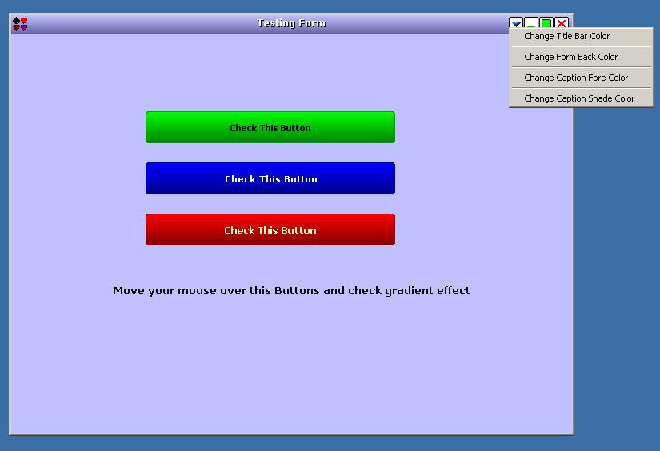



## Form Skin Control

### Description

Form Skin Control.

Feature:

1. Customized Form Caption.

2. Change Form Back Color, Caption Color.

3. Customized System Menu.

4. Customized Control Box.

5. Fade In Fade Out Effect,

6. Gradient Button.

. Drag the Skin control and placed it in the form.

. Add Gradient Button.

. According to your form border style it will resize.

Click On SkinCtlGr.vbg. Run The project.
 
### More Info
 

             |
---                |---
**Submitted On**   |2006-03-11 09:50:56
**By**             |[Debghosh](https://github.com/Planet-Source-Code/PSCIndex/blob/master/ByAuthor/debghosh.md)
**Level**          |Advanced
**User Rating**    |4.3 (17 globes from 4 users)
**Compatibility**  |VB 6\.0
**Category**       |[OLE/ COM/ DCOM/ Active\-X](https://github.com/Planet-Source-Code/PSCIndex/blob/master/ByCategory/ole-com-dcom-active-x__1-29.md)
**World**          |[Visual Basic](https://github.com/Planet-Source-Code/PSCIndex/blob/master/ByWorld/visual-basic.md)
**Archive File**   |[Form\_Skin\_1979573122006\.zip](https://github.com/Planet-Source-Code/debghosh-form-skin-control__1-64624/archive/master.zip)

